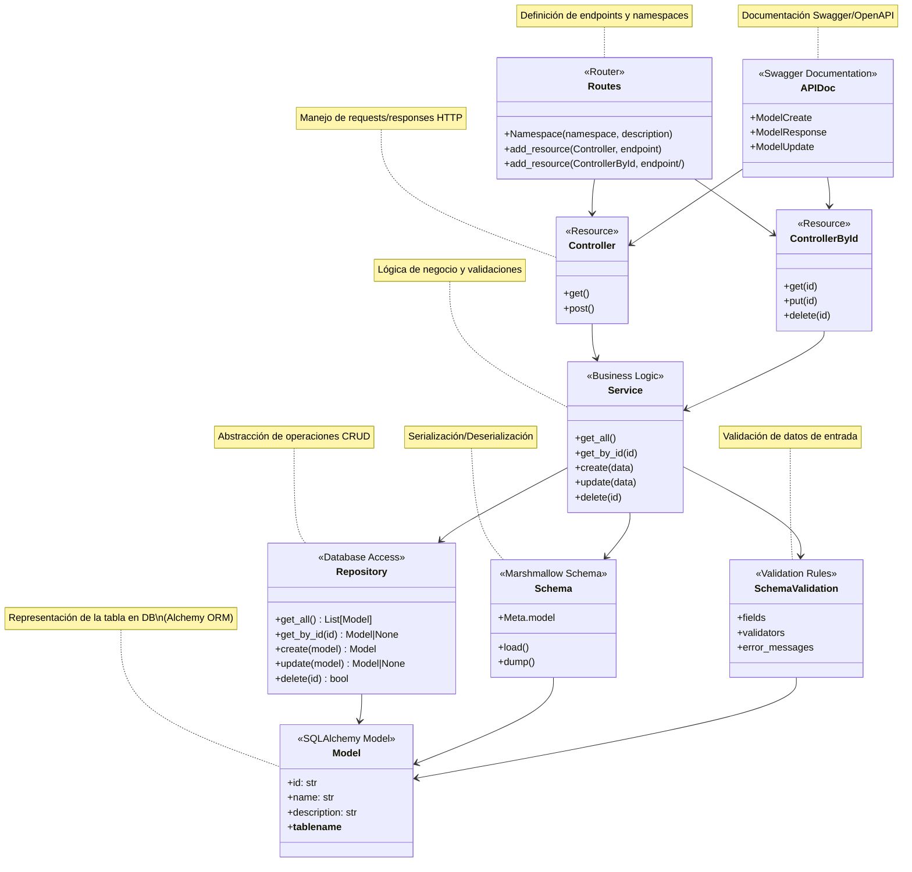
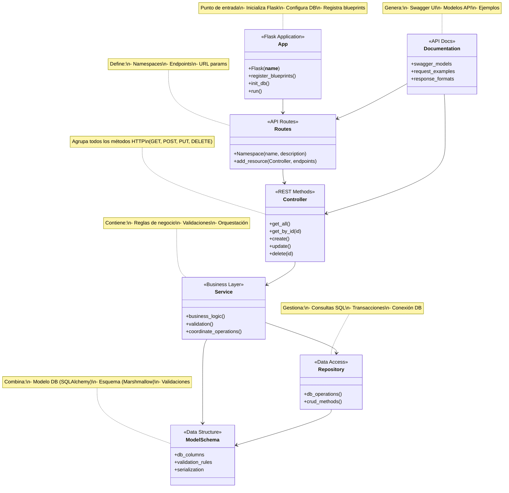

Debido a que nos basaremos en una arquitectura basada en features en el proyecto, crearemos una carpeta con el modelo, esquema, controlador y rutas por cada funcionalidad de la API

### Estructura del Proyecto
```
./
├── .env                        # Variables de entorno
├── .gitignore                  # Archivos ignorados por Git
├── docker-compose.yml          # Configuración de servicios Docker
├── README.md                   # Documentación del proyecto
├── requirements.txt            # Dependencias de Python
├── app.py                  # Punto de entrada de la aplicación
├── settings.py             # Configuración global
├── .data/db/                   # Datos para contenedor de DB
├── scripts/                    # Scripts utilitarios
│   ├── wait-for-it.sh          # Esperar servicios dependientes
├── dockerfiles/                        
│   ├── Dockerfile              # Dockerfile
│
├── src/                        # Código fuente principal
│   │
│   ├── common/                 # Utilidades compartidas
│   │   ├── utils.py            # Funciones utilitarias
│   │   └── constants.py        # Constantes globales
│   │
│   ├── features/               # Módulos de features (cada uno autocontenido)
│   │   └── {feature_name}/     # Ej: products, users, orders
│   │       ├── {feature}_controller.py  # Lógica de endpoints
│   │       ├── {feature}_model.py       # Modelos SQLAlchemy
│   │       ├── {feature}_routes.py      # Definición de rutas
│   │       ├── {feature}_schema.py      # Esquemas Marshmallow
│   │       ├── {feature}_doc.py         # Modelos Swagger/OpenAPI
│   │       ├── {feature}_repository.py  # (Opcional) Patrón Repository
│   │       ├── {feature}_service.py     # (Opcional) Lógica de negocio
│   │       └── README.md                # Documentación
│   │
│   └── routes/                 # Rutas globales
│       └── routes.py           
│
└── tests/                      # Tests integrales/end-to-end
    ├── conftest.py             # Configuración de pytest
    └── integration/            # Tests de integración
```

### Características Clave

1. **Organización por Dominio**:
   - Cada feature agrupa todos los archivos relacionados (desde modelo hasta rutas)
   - Ejemplo para `products`:
     ```
     src/features/products/
     ├── products_controller.py
     ├── products_model.py
     ├── products_repository.py
     ├── products_routes.py
     ├── products_schema.py
     ├── products_service.py
     └── products_doc.py
     ```

2. **Principios SOLID**:
   - **Single Responsibility**: Cada archivo tiene un único propósito
   - **Open/Closed**: Features pueden extenderse sin modificar código existente

4. **Escalabilidad**:
   - Nuevas features se añaden como carpetas independientes
   - Features pueden desplegarse como microservicios si crecen

### Ventajas de esta Estructura

1. **Encapsulamiento**: Cada feature maneja sus propias dependencias
2. **Testabilidad**: Fácil de mockear y probar de forma aislada
3. **Mantenibilidad**: Cambios afectan solo al feature modificado
4. **Onboarding**: Nueva gente entiende la estructura rápidamente

### Recomendaciones Adicionales

1. **Nomenclatura Consistente**:
   - Usar snake_case para archivos (`user_management_routes.py`)
   - Usar PascalCase para clases (`UserManagementController`)

2. **Documentación**:
   - Incluir un `README.md` dentro de cada feature complejo
   - Documentar interfaces entre features

# Diagrama General


### Explicación de las capas:

1. **Routes**: 
   - Define los endpoints y namespaces de la API
   - Conecta URLs con los controladores

2. **Controllers**: 
   - Maneja requests HTTP
   - Devuelve responses apropiadas
   - Captura excepciones

3. **Services**:
   - Contiene la lógica de negocio
   - Coordina validaciones y operaciones
   - Usa Repository y Schemas

4. **Repository**:
   - Abstracción de acceso a DB
   - Operaciones CRUD básicas
   - Aislado de lógica de negocio

5. **Model**:
   - Representación de la tabla en DB
   - Definición de relaciones
   - Configuración de columnas

6. **Schemas**:
   - Serialización/deserialización
   - Conversión entre JSON y objetos
   - Incluye esquemas de validación

7. **APIDoc**:
   - Documentación Swagger
   - Modelos de request/response
   - Ejemplos y descripciones

Este diagrama muestra el flujo típico:
`Routes → Controller → Service → Repository → Model ← Schema`


# Diagrama simplificado



