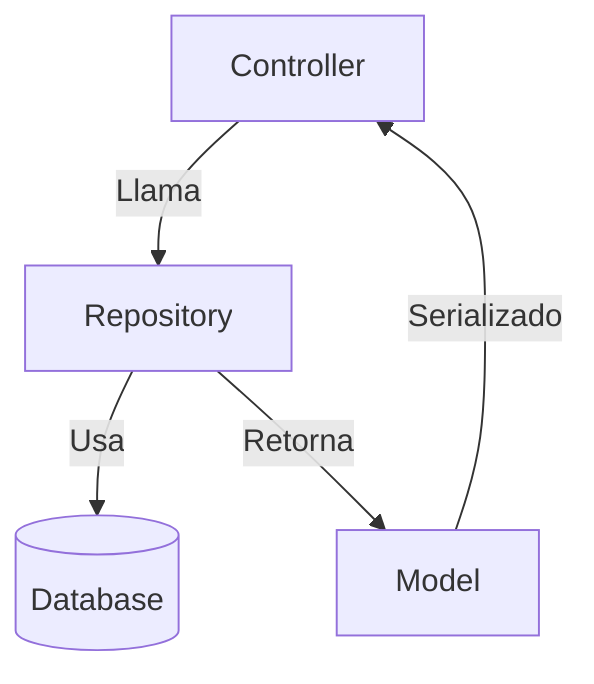

## 06. Repository (`feature_repository.py`)
**Propósito**: Abstrae el acceso a la base de datos siguiendo el patrón Repository, centralizando las operaciones CRUD.

**Ubicación**:  
```
src/features/feature/feature_repository.py
```


## SQLAlchemy 2.0 — Conceptos Básicos

|Concepto|Descripción|Ejemplo|
|---|---|---|
|`select(Model)`|Construcción de consultas SELECT|`select(UserModel)`|
|`.filter_by()`|Filtro por campos exactos|`.filter_by(id=1)`|
|`.scalar_one_or_none()`|Devuelve un único resultado o `None`|`session.execute(stmt).scalar_one_or_none()`|
|`.scalars().all()`|Devuelve todos los resultados como lista de modelos|`session.execute(stmt).scalars().all()`|
|`.add()`|Añade instancia al contexto de sesión|`session.add(obj)`|
|`.commit()`|Confirma los cambios|`session.commit()`|
|`.delete()`|Elimina instancia|`session.delete(obj)`|
|`db.paginate()`|Paginación integrada en Flask-SQLAlchemy|`db.paginate(select(UserModel), page=1, per_page=10)`|
|`db.exists()`|Consulta booleana para verificar existencia|`session.query(db.exists().where(...)).scalar()`|

---

## CRUD con SQLAlchemy 2.0

| Operación      | Código                                                                 |
| -------------- | ---------------------------------------------------------------------- |
| **Create**     | `session.add(obj)`  <br>`session.commit()`                             |
| **Read All**   | `session.execute(select(Model)).scalars().all()`                       |
| **Read by ID** | `session.execute(select(Model).filter_by(id=id)).scalar_one_or_none()` |
| **Update**     | Modificar atributos en la instancia recuperada + `session.commit()`    |
| **Delete**     | `session.delete(obj)`  <br>`session.commit()`                          |


### Estructura Base
```python
from typing import List, Optional
from src.common.utils import db
from src.features.feature.feature_model import FeatureModel

class FeatureRepository:
    @staticmethod
    def get_all() -> List[FeatureModel]:
        """Obtiene todos los recursos"""
        return db.session.execute(db.select(FeatureModel)).scalars().all()

    @staticmethod
    def get_by_id(id: str) -> Optional[FeatureModel]:
        """Obtiene un recurso por su ID"""
        return db.session.execute(
            db.select(FeatureModel).filter_by(id=id)
        ).scalar_one_or_none()

    @staticmethod
    def create(feature: FeatureModel) -> FeatureModel:
        """Crea un nuevo recurso"""
        db.session.add(feature)
        db.session.commit()
        return FeatureRepository.get_by_id(feature.id)

    @staticmethod
    def update(feature: FeatureModel) -> Optional[FeatureModel]:
        """Actualiza un recurso existente"""
        existing = FeatureRepository.get_by_id(feature.id)
        if not existing:
            return None
            
        for attr, value in vars(feature).items():
            if attr != "id" and not attr.startswith("_"):
                setattr(existing, attr, value)
                
        db.session.commit()
        return FeatureRepository.get_by_id(feature.id)

    @staticmethod
    def delete(id: str) -> bool:
        """Elimina un recurso"""
        feature = FeatureRepository.get_by_id(id)
        if not feature:
            return False
            
        db.session.delete(feature)
        db.session.commit()
        return True
```

### Operaciones Avanzadas
```python
    @staticmethod
    def get_by_field(field: str, value: str) -> Optional[FeatureModel]:
        """Busca por un campo específico"""
        return db.session.execute(
            db.select(FeatureModel).filter_by(**{field: value})
        ).scalar_one_or_none()

    @staticmethod
    def get_paginated(page: int = 1, per_page: int = 10) -> List[FeatureModel]:
        """Obtiene recursos paginados"""
        return db.paginate(
            db.select(FeatureModel),
            page=page,
            per_page=per_page
        ).items
```

### Buenas Prácticas

1. **Tipado Estricto**:
   ```python
   def get_active() -> List[FeatureModel]:
       return db.session.execute(
           db.select(FeatureModel).filter_by(is_active=True)
       ).scalars().all()
   ```

### Diagrama de Flujo


**Documentación Oficial**:
- [SQLAlchemy 2.0 Queries](https://docs.sqlalchemy.org/en/20/orm/queryguide.html)
- [Repository Pattern](https://learn.microsoft.com/en-us/dotnet/architecture/microservices/microservice-ddd-cqrs-patterns/infrastructure-persistence-layer-design)

---

### Métodos Adicionales Recomendados

```python
@staticmethod
def exists(id: str) -> bool:
    """Verifica si un recurso existe"""
    return db.session.query(
        db.exists().where(FeatureModel.id == id)
    ).scalar()

@staticmethod
def count() -> int:
    """Cuenta todos los recursos"""
    return db.session.query(FeatureModel).count()
```


**Documentacion:**
https://docs.sqlalchemy.org/en/20/orm/session_basics.html#querying

https://docs.sqlalchemy.org/en/20/core/sqlelement.html#column-element-foundational-constructors

