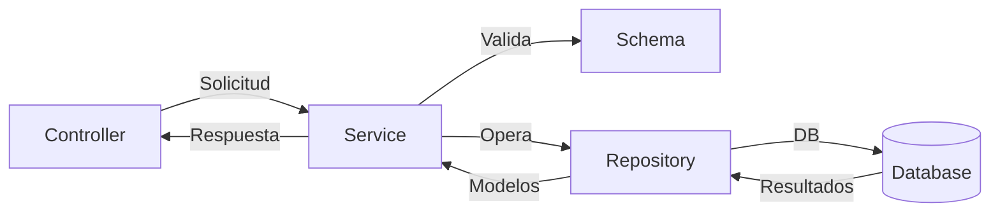

---

## 7. Service Layer (`feature_service.py`)  
**Propósito**: Contiene la lógica de negocio y actúa como intermediario entre los controllers y el repositorio, manejando validaciones y reglas de negocio.  

**Ubicación**:  
```
src/features/feature/feature_service.py  
```

### Estructura Base  
```python  
from typing import List, Optional  
from src.features.feature.feature_model import FeatureModel  
from src.features.feature.feature_schema import (  
    FeatureSchema,  
    FeatureValidationSchema  
)  
from src.features.feature.repositories.feature_repository import FeatureRepository  

class FeatureService:  
    @staticmethod  
    def get_all() -> List[FeatureModel]:  
        """Obtiene todos los recursos"""  
        return FeatureRepository.get_all()  

    @staticmethod  
    def get_by_id(id: str) -> Optional[FeatureModel]:  
        """Obtiene un recurso por su ID"""  
        return FeatureRepository.get_by_id(id)  

    @staticmethod  
    def create(data: dict) -> FeatureModel:  
        """Crea un nuevo recurso con validación"""  
        validated_data = FeatureValidationSchema(exclude=["id"]).load(data)  
        feature = FeatureSchema().load(validated_data)  
        return FeatureRepository.create(feature)  

    @staticmethod  
    def update(data: dict) -> Optional[FeatureModel]:  
        """Actualiza un recurso existente"""  
        validated_data = FeatureValidationSchema().load(data)  
        feature = FeatureSchema().load(validated_data)  
        return FeatureRepository.update(feature)  

    @staticmethod  
    def delete(id: str) -> bool:  
        """Elimina un recurso"""  
        return FeatureRepository.delete(id)  
```  

---

### Operaciones Avanzadas  

#### 1. **Validación de Negocio**  
```python  
    @staticmethod  
    def create_with_rules(data: dict) -> Optional[FeatureModel]:  
        """Crea un recurso con reglas adicionales"""  
        if FeatureRepository.exists_by_field("name", data["name"]):  
            raise ValueError("El nombre ya existe")

        validated_data = FeatureValidationSchema().load(data)  
        feature = FeatureSchema().load(validated_data)  
        return FeatureRepository.create(feature), "Creado exitosamente"  
```  

#### 2. **Transacciones Complejas**  
```python  
from src.common.utils import db  

    @staticmethod  
    def bulk_create(items: List[dict]) -> List[FeatureModel]:  
        """Crea múltiples recursos en una transacción atómica"""  
        try:  
            features = []  
            for item in items:  
                validated = FeatureValidationSchema(exclude=["id"]).load(item)  
                features.append(FeatureSchema().load(validated))  

            db.session.add_all(features)  
            db.session.commit()  
            return features  
        except Exception:  
            db.session.rollback()  
            raise  
```  


---

### Flujo de Trabajo  



---


### Documentación Oficial  
- [Python Typing](https://docs.python.org/3/library/typing.html)  
- [Marshmallow Validation](https://marshmallow.readthedocs.io/en/stable/)  
- [SQLAlchemy Sessions](https://docs.sqlalchemy.org/en/20/orm/session_basics.html)  

--- 

