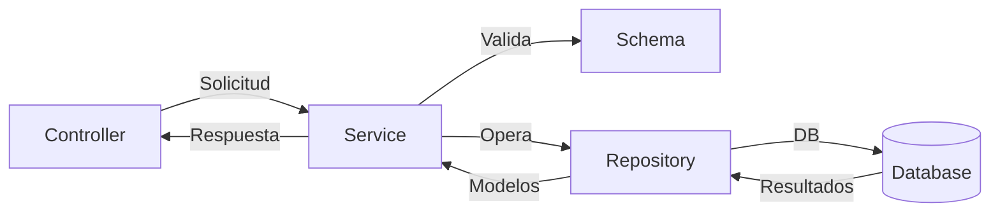

---

## 7. Service Layer (`feature_service.py`)  

**Propósito**: Contiene toda la lógica de negocio, validaciones, transformación de datos y comunicación con el repositorio. Devuelve un diccionario con la carga (`data`), mensajes de error (`error` / `details`) y el código de estado HTTP (`status_code`).

**Ubicación**:

```
src/features/feature/feature_service.py
```
### Estructura Base  
```python  
import logging
from typing import List, Optional, Dict, Any
from flask import jsonify
from marshmallow import ValidationError
from sqlalchemy.exc import IntegrityError
from src.features.feature.feature_model import FeatureModel
from src.features.feature.feature_schema import (
    FeatureSchema,
    FeatureValidationSchema
)
from src.features.feature.repositories.feature_repository import FeatureRepository
import os


env = os.getenv("FLASK_ENV", "development")
DEBUG = False
if env == 'development':
	DEBUG = True
elif env == 'testing':
	DEBUG = True


logger = logging.getLogger(__name__)

class FeatureService:
    @staticmethod
    def get_all() -> Dict[str, Any]:
        """Obtiene y serializa todos los recursos"""
        try:
            features: List[FeatureModel] = FeatureRepository.get_all()
            data = FeatureSchema(many=True).dump(features)
            return {"data": data, "status_code": 200}

        except Exception as e:
            logger.error(f"Error crítico en FeatureService.get_all: {str(e)}")
            return {
                "error": "Error al procesar la solicitud",
                "details": str(e) if DEBUG else None,
                "status_code": 500
            }

    @staticmethod
    def get_by_id(id: str) -> Dict[str, Any]:
        """Obtiene y serializa un recurso por ID"""
        try:
            feature = FeatureRepository.get_by_id(id)
            if not feature:
                return {"error": "Recurso no encontrado", "status_code": 404}

            return {"data": FeatureSchema().dump(feature), "status_code": 200}

        except Exception as e:
            logger.error(f"Error crítico en FeatureService.get_by_id: {str(e)}")
            return {
                "error": "Error al procesar la solicitud",
                "details": str(e) if DEBUG else None,
                "status_code": 500
            }

    @staticmethod
    def create(data: Dict[str, Any]) -> Dict[str, Any]:
        """Valida, crea y serializa un nuevo recurso"""
        try:
            validated = FeatureValidationSchema(exclude=["id"]).load(data)
            feature: FeatureModel = FeatureSchema().load(validated)
            created = FeatureRepository.create(feature)
            return {"data": FeatureSchema().dump(created), "status_code": 201}

        except ValidationError as e:
            return {"error": "Error de validación", "details": e.messages, "status_code": 422}

        except IntegrityError as e:
            logger.error(f"Error de integridad en FeatureService.create: {str(e)}")
            return {"error": "Conflicto de datos (duplicado)", "status_code": 409}

        except Exception as e:
            logger.error(f"Error crítico en FeatureService.create: {str(e)}")
            return {
                "error": "Error al procesar la solicitud",
                "details": str(e) if DEBUG else None,
                "status_code": 500
            }

    @staticmethod
    def update(data: Dict[str, Any]) -> Dict[str, Any]:
        """Valida, actualiza y serializa un recurso existente"""
        try:
            validated = FeatureValidationSchema().load(data)
            feature: FeatureModel = FeatureSchema().load(validated)
            updated = FeatureRepository.update(feature)

            if not updated:
                return {"error": "Recurso no encontrado", "status_code": 404}

            return {"data": FeatureSchema().dump(updated), "status_code": 200}

        except ValidationError as e:
            return {"error": "Error de validación", "details": e.messages, "status_code": 422}

        except Exception as e:
            logger.error(f"Error crítico en FeatureService.update: {str(e)}")
            return {
                "error": "Error al procesar la solicitud",
                "details": str(e) if DEBUG else None,
                "status_code": 500
            }

    @staticmethod
    def delete(id: str) -> Dict[str, Any]:
        """Elimina un recurso y retorna respuesta apropiada"""
        try:
            success: bool = FeatureRepository.delete(id)
            if not success:
                return {"error": "Recurso no encontrado", "status_code": 404}

            return {"data": None, "status_code": 204}

        except Exception as e:
            logger.error(f"Error crítico en FeatureService.delete: {str(e)}")
            return {
                "error": "Error al procesar la solicitud",
                "details": str(e) if DEBUG else None,
                "status_code": 500
            }
```  

---
---

### Flujo de Trabajo  



---


### Documentación Oficial  
- [Python Typing](https://docs.python.org/3/library/typing.html)  
- [Marshmallow Validation](https://marshmallow.readthedocs.io/en/stable/)  
- [SQLAlchemy Sessions](https://docs.sqlalchemy.org/en/20/orm/session_basics.html)  

--- 
