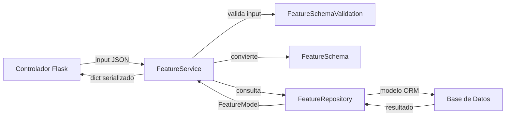

---

## 7. Service Layer (`feature_service.py`)

**Propósito**: Implementar toda la lógica de negocio y validación para operaciones CRUD sobre una entidad. Esta capa se comunica directamente con el repositorio y utiliza esquemas de validación/serialización (`marshmallow`). Devuelve siempre una tupla de diccionario con datos o errores, más el código de estado HTTP.

**Ubicación**:

```
src/features/feature/feature_service.py
```

---

### Estructura Base

```python
import os
import logging
from typing import List, Dict, Any, Optional
from marshmallow import ValidationError
from sqlalchemy.exc import IntegrityError, DataError, OperationalError
from src.common.utils import db
from src.features.feature.feature_model import FeatureModel
from src.features.feature.feature_schema import FeatureSchema, FeatureSchemaValidation
from src.features.feature.feature_repository import FeatureRepository

env = os.getenv("FLASK_ENV", "development")
DEBUG = env in ['development', 'testing']
logger = logging.getLogger(__name__)

class FeatureService:
    @staticmethod
    def get_all() -> Dict[str, Any]:
        try:
            features: List[FeatureModel] = FeatureRepository.get_all()
            return FeatureSchema(many=True).dump(features), 200
        except Exception as e:
            logger.error(f"Error crítico en FeatureService.get_all: {str(e)}")
            return {"error": "Error al procesar la solicitud", "details": str(e) if DEBUG else None}, 500

    @staticmethod
    def get_by_id(id: str) -> Dict[str, Any]:
        try:
            feature: Optional[FeatureModel] = FeatureRepository.get_by_id(id)
            if not feature:
                return {"error": "Recurso no encontrado"}, 404
            return FeatureSchema().dump(feature), 200
        except Exception as e:
            logger.error(f"Error crítico en FeatureService.get_by_id: {str(e)}")
            return {"error": "Error al procesar la solicitud", "details": str(e) if DEBUG else None}, 500

    @staticmethod
    def create(data: Dict[str, Any]) -> Dict[str, Any]:
        try:
            valid_data = FeatureSchemaValidation(exclude=["id"]).load(data)
            feature = FeatureSchema().load(valid_data)
            created = FeatureRepository.create(feature)
            return FeatureSchema().dump(created), 201
        except ValidationError as e:
            db.session.rollback()
            return {"error": "Error de validación", "details": e.messages}, 422
        except IntegrityError as e:
            db.session.rollback()
            msg = str(e.orig).lower()
            logger.error(f"Error de integridad en FeatureService.create: {str(e)}")
            if "duplicate key" in msg:
                return {"error": "Recurso duplicado"}, 409
            return {"error": "Conflicto de integridad de datos", "details": str(e) if DEBUG else None}, 409
        except DataError as e:
            db.session.rollback()
            logger.error(f"Error de datos en FeatureService.create: {str(e)}")
            return {"error": "Datos inválidos", "details": str(e) if DEBUG else None}, 400
        except OperationalError as e:
            db.session.rollback()
            logger.error(f"Error operativo en FeatureService.create: {str(e)}")
            return {"error": "Error operacional", "details": str(e) if DEBUG else None}, 500
        except Exception as e:
            db.session.rollback()
            logger.error(f"Error crítico en FeatureService.create: {str(e)}")
            return {"error": "Error interno", "details": str(e) if DEBUG else None}, 500

    @staticmethod
    def update(data: Dict[str, Any]) -> Dict[str, Any]:
        try:
            valid_data = FeatureSchemaValidation().load(data)
            feature = FeatureSchema().load(valid_data)
            updated = FeatureRepository.update(feature)
            if not updated:
                return {"error": "Recurso no encontrado"}, 404
            return FeatureSchema().dump(updated), 200
        except ValidationError as e:
            db.session.rollback()
            return {"error": "Error de validación", "details": e.messages}, 422
        except IntegrityError as e:
            db.session.rollback()
            msg = str(e.orig).lower()
            logger.error(f"Error de integridad en FeatureService.update: {str(e)}")
            if "duplicate key" in msg:
                return {"error": "Recurso duplicado"}, 409
            return {"error": "Conflicto de integridad de datos", "details": str(e) if DEBUG else None}, 409
        except DataError as e:
            db.session.rollback()
            logger.error(f"Error de datos en FeatureService.update: {str(e)}")
            return {"error": "Datos inválidos", "details": str(e) if DEBUG else None}, 400
        except OperationalError as e:
            db.session.rollback()
            logger.error(f"Error operativo en FeatureService.update: {str(e)}")
            return {"error": "Error operacional", "details": str(e) if DEBUG else None}, 500
        except Exception as e:
            db.session.rollback()
            logger.error(f"Error crítico en FeatureService.update: {str(e)}")
            return {"error": "Error interno", "details": str(e) if DEBUG else None}, 500

    @staticmethod
    def delete(id: str) -> Dict[str, Any]:
        try:
            deleted = FeatureRepository.delete(id)
            if not deleted:
                return {"error": "Recurso no encontrado"}, 404
            return {}, 204
        except IntegrityError as e:
            db.session.rollback()
            logger.error(f"Error de integridad en FeatureService.delete: {str(e)}")
            return {"error": "Conflicto de integridad de datos", "details": str(e) if DEBUG else None}, 409
        except OperationalError as e:
            db.session.rollback()
            logger.error(f"Error operativo en FeatureService.delete: {str(e)}")
            return {"error": "Error operacional", "details": str(e) if DEBUG else None}, 500
        except Exception as e:
            db.session.rollback()
            logger.error(f"Error crítico en FeatureService.delete: {str(e)}")
            return {"error": "Error interno", "details": str(e) if DEBUG else None}, 500
```

---

### Flujo de Trabajo



---

### Convenciones

* Todos los métodos devuelven una tupla: `(respuesta: dict, status_code: int)`
* La validación de entrada se hace con `FeatureSchemaValidation`
* La serialización se hace con `FeatureSchema`
* Se hace `rollback()` manual tras errores críticos
* Se ajusta la respuesta según el entorno (DEBUG)

---

### Enlaces de Referencia

* [Marshmallow Validation](https://marshmallow.readthedocs.io/en/stable/)
* [SQLAlchemy Error Handling](https://docs.sqlalchemy.org/en/20/errors.html)
* [Logging en Python](https://docs.python.org/3/library/logging.html)
* [Typing en Python](https://docs.python.org/3/library/typing.html)

---
