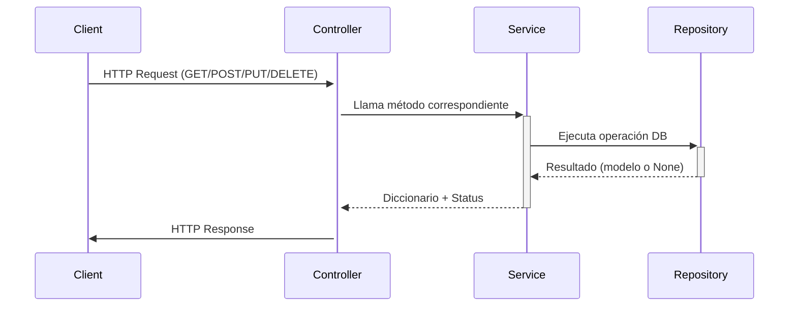

## 8. Controller (`feature_controller.py`)

**Propósito**: Maneja las solicitudes HTTP, invoca métodos del Service Layer, y devuelve respuestas API según el estado de la operación. Aplica seguridad y documentación mediante Flask-RESTx y decoradores de autorización.

**Ubicación**:

```
src/features/feature/feature_controller.py
```

---

### Estructura Base con Service Layer y Seguridad

```python
from flask_restx import Resource
from flask import request
from src.common.utils import db, api, ErrorResponseModel, SuccessResponseModel
from src.features.feature.feature_schema import FeatureSchema
from src.features.feature.feature_doc import FeatureCreateDoc, FeatureResponseDoc, FeatureManipulateDoc
from src.features.feature.feature_service import FeatureService
from src.security.firebase_required import firebase_role_required


class FeatureController(Resource):
    @api.doc(description='Obtiene todos los recursos', security='Bearer')
    @api.response(200, 'Éxito', [FeatureResponseDoc])
    @api.response(404, 'No se encontraron recursos', ErrorResponseModel)
    @api.response(500, 'Error interno del servidor', ErrorResponseModel)
    @firebase_role_required('public')
    def get(self):
        features_list = FeatureService.get_all()
        if not features_list[0]:  # se espera tupla (data, status)
            return {"error": "No se encontraron recursos"}, 404
        return features_list


    @api.doc(description='Crea un nuevo recurso', security='Bearer')
    @api.expect(FeatureCreateDoc)
    @api.response(201, 'Recurso creado exitosamente', FeatureResponseDoc)
    @api.response(400, 'Solicitud incorrecta', ErrorResponseModel)
    @api.response(401, 'No autorizado', ErrorResponseModel)
    @api.response(403, 'Error de autorización', ErrorResponseModel)
    @api.response(409, 'Conflicto de datos', ErrorResponseModel)
    @api.response(422, 'Error de validación', ErrorResponseModel)
    @api.response(500, 'Error interno del servidor', ErrorResponseModel)
    @firebase_role_required()
    def post(self):
        return FeatureService.create(request.json)


    @api.doc(description='Actualiza un recurso existente', security='Bearer')
    @api.expect(FeatureManipulateDoc)
    @api.response(200, 'Recurso actualizado exitosamente', FeatureResponseDoc)
    @api.response(400, 'Solicitud incorrecta', ErrorResponseModel)
    @api.response(401, 'No autorizado', ErrorResponseModel)
    @api.response(403, 'Error de autorización', ErrorResponseModel)
    @api.response(404, 'Recurso no encontrado', ErrorResponseModel)
    @api.response(409, 'Conflicto de datos', ErrorResponseModel)
    @api.response(422, 'Error de validación', ErrorResponseModel)
    @api.response(500, 'Error interno del servidor', ErrorResponseModel)
    @firebase_role_required()
    def put(self):
        return FeatureService.update(request.json)
```

---

### Controlador para Operaciones por ID

```python
class FeatureControllerById(Resource):

    @api.doc(description='Obtiene un recurso por ID', security='Bearer')
    @api.param('id', 'ID del recurso', _in='path')
    @api.response(200, 'Éxito', FeatureResponseDoc)
    @api.response(404, 'Recurso no encontrado', ErrorResponseModel)
    @api.response(500, 'Error interno del servidor', ErrorResponseModel)
    @firebase_role_required('public')
    def get(self, id):
        return FeatureService.get_by_id(id)

    @api.doc(description='Elimina un recurso por ID', security='Bearer')
    @api.param('id', 'ID del recurso', _in='path')
    @api.response(204, 'Recurso eliminado exitosamente', SuccessResponseModel)
    @api.response(404, 'Recurso no encontrado', ErrorResponseModel)
    @api.response(500, 'Error interno del servidor', ErrorResponseModel)
    @firebase_role_required()
    def delete(self, id):
        return FeatureService.delete(id)
```

---

### Patrones Clave

| Responsabilidad | Delegado a                              | Justificación                                         |
| --------------- | --------------------------------------- | ----------------------------------------------------- |
| Validación      | Service Layer (`marshmallow`)           | Separación de lógica y simplificación del controlador |
| Serialización   | `FeatureSchema`                         | Consistencia estructural de salida                    |
| Seguridad       | Decorador `@firebase_role_required`     | Control de acceso por rol (JWT Firebase)              |
| Documentación   | Flask-RESTx (`@api.doc`, `@api.expect`) | Swagger automático                                    |

---

### Diagrama de Flujo HTTP



---

### Ejemplo de Códigos y Cuerpos de Respuesta

| Código | Método           | Body de Ejemplo                                                  |
| ------ | ---------------- | ---------------------------------------------------------------- |
| 200    | `GET`            | `{"id": "abc123", "nombre": "Recurso A"}`                        |
| 201    | `POST`           | `{"id": "def456", "nombre": "Nuevo Recurso"}`                    |
| 204    | `DELETE`         | ` {}`                                                            |
| 404    | `GET/PUT/DELETE` | `{"error": "Recurso no encontrado"}`                             |
| 409    | `POST/PUT`       | `{"error": "Recurso duplicado"}`                                 |
| 422    | `POST/PUT`       | `{"error": "Error de validación", "details": {"nombre": [...]}}` |

---

### Enlaces de Referencia

* [Flask-RESTx](https://flask-restx.readthedocs.io/en/latest/)
* [HTTP Status Codes](https://developer.mozilla.org/en-US/docs/Web/HTTP/Status)
* [Autenticación Firebase JWT](https://firebase.google.com/docs/auth/admin/verify-id-tokens)

---
