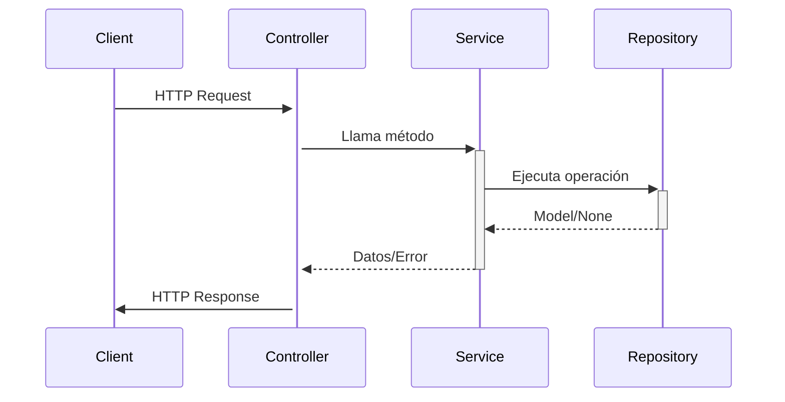

## 8. Controller (`feature_controller.py`)  
**Propósito**: Maneja las solicitudes HTTP, orquesta llamadas al Service Layer y formatea respuestas API.  

**Ubicación**:  
```
src/features/feature/feature_controller.py  
```

### Estructura Base con Service Layer
```python
from flask_restx import Namespace, Resource
from flask import request
from src.features.feature.feature_service import FeatureService
from src.features.feature.feature_schema import FeatureResponseDoc, FeatureCreateDoc, FeatureUpdateDoc
from src.common.utils import ErrorResponseModel

api = Namespace('feature', description='API de Features')


class FeatureController(Resource):
    @api.doc(description='Obtiene todos los recursos')
    @api.response(200, 'Éxito', [FeatureResponseDoc])
    @api.response(500, 'Error interno', ErrorResponseModel)
    def get(self):
        """Lista todos los recursos usando Service Layer"""
        return FeatureService.get_all()

    @api.doc(description='Crea un nuevo recurso')
    @api.expect(FeatureCreateDoc)
    @api.response(201, 'Creado', FeatureResponseDoc)
    @api.response(422, 'Error de validación', ErrorResponseModel)
    @api.response(409, 'Conflicto de datos', ErrorResponseModel)
    @api.response(500, 'Error interno', ErrorResponseModel)
    def post(self):
        """Crea un recurso mediante Service Layer"""
        return FeatureService.create(request.json)


```

### Controller para Operaciones por ID
```python

class FeatureDetailController(Resource):
    @api.doc(description='Obtiene un recurso por ID')
    @api.param('id', 'ID del recurso', _in='path')
    @api.response(200, 'Éxito', FeatureResponseDoc)
    @api.response(404, 'No encontrado', ErrorResponseModel)
    @api.response(500, 'Error interno', ErrorResponseModel)
    def get(self, id):
        """Obtiene un recurso específico"""
        return FeatureService.get_by_id(id)

    @api.doc(description='Actualiza un recurso existente')
    @api.expect(FeatureUpdateDoc)
    @api.param('id', 'ID del recurso', _in='path')
    @api.response(200, 'Actualizado', FeatureResponseDoc)
    @api.response(404, 'No encontrado', ErrorResponseModel)
    @api.response(422, 'Error de validación', ErrorResponseModel)
    @api.response(500, 'Error interno', ErrorResponseModel)
    def put(self, id):
        """Actualiza un recurso mediante Service Layer"""
        data = request.json
        data['id'] = id
        return FeatureService.update(data)

    @api.doc(description='Elimina un recurso')
    @api.response(204, 'Eliminado')
    @api.response(404, 'No encontrado', ErrorResponseModel)
    @api.response(500, 'Error interno', ErrorResponseModel)
    def delete(self, id):
        """Elimina un recurso mediante Service Layer"""
        return FeatureService.delete(id)
```

### Patrones Clave con Service Layer

| Escenario | Implementación | Beneficio |
|-----------|----------------|-----------|
| **Validaciones** | Delegadas al Service Layer | Controllers más limpios |
| **Transformación de Datos** | Manejada en Schemas | Separación de preocupaciones |
| **Gestión de Errores** | Centralizada en Service | Consistencia API |

### Diagrama de Flujo


### Ejemplo de Respuestas Estándar

| Código | Método         | Body de Ejemplo                                     |
| ------ | -------------- | --------------------------------------------------- |
| 200    | GET            | `{id: "123", name: "Feature 1"}`                    |
| 201    | POST           | `{id: "456", name: "New Feature"}`                  |
| 204    | DELETE         | Vacío                                               |
| 404    | GET/PUT/DELETE | `{"error": "No encontrado"}`                        |
| 422    | POST/PUT       | `{"error": "Validación fallida", "details": {...}}` |

### Documentación Oficial
- [Flask-RESTx](https://flask-restx.readthedocs.io/en/latest/)
- [HTTP Status Codes](https://developer.mozilla.org/en-US/docs/Web/HTTP/Status)
- [Logging Best Practices](https://docs.python.org/3/howto/logging.html)

