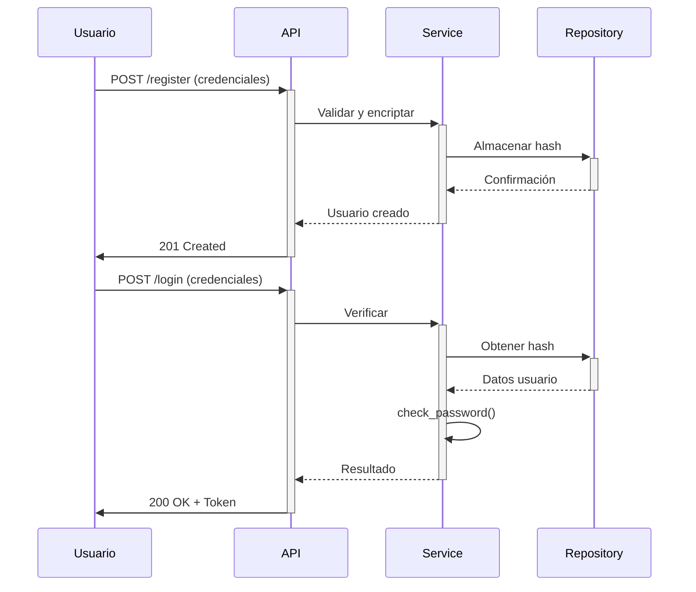

## Estructura de Implementación

```
src/features/auth/
├── auth_model.py          # Modelo de usuario con contraseña segura
├── auth_schema.py         # Validación y serialización
├── auth_service.py        # Lógica de encriptación
├── auth_controller.py     # Endpoints de registro/login
├── auth_repository.py     # Operaciones de base de datos
└── auth_doc.py           # Documentación Swagger
```

---

## 1. Modelo de Usuario (`auth_model.py`)

```python
from src.common.utils import db
from sqlalchemy.orm import Mapped, mapped_column
from sqlalchemy import String
import bcrypt

class UserModel(db.Model):
    __tablename__ = "users"
    
    id: Mapped[str] = mapped_column(String(36), primary_key=True, default=lambda: str(uuid.uuid4()))
    email: Mapped[str] = mapped_column(String(255), unique=True, nullable=False)
    password_hash: Mapped[str] = mapped_column(String(60), nullable=False)  # BCrypt genera hash de 60 chars
    
    def set_password(self, password: str):
        """Genera hash seguro con bcrypt"""
        salt = bcrypt.gensalt(rounds=12)  # Coste computacional ajustado
        self.password_hash = bcrypt.hashpw(password.encode('utf-8'), salt).decode('utf-8')
    
    def check_password(self, password: str) -> bool:
        """Verifica contraseña contra hash almacenado"""
        return bcrypt.checkpw(password.encode('utf-8'), self.password_hash.encode('utf-8'))
```

**Configuraciones Clave**:
- `rounds=12`: Balance entre seguridad y rendimiento (12 es estándar actual)
- `String(60)`: Longitud fija para hashes BCrypt

---

## 2. Esquemas de Validación (`auth_schema.py`)

```python
from marshmallow import Schema, fields, validate, validates_schema, ValidationError

class UserRegisterSchema(Schema):
    email = fields.Email(required=True)
    password = fields.String(
        required=True,
        validate=[
            validate.Length(min=12, max=128),
            validate.Regexp(r'(?=.*\d)(?=.*[a-z])(?=.*[A-Z]).*', 
                           error="Debe contener mayúsculas, minúsculas y números")
        ],
        load_only=True  # Nunca se muestra en respuestas
    )
    password_confirm = fields.String(required=True, load_only=True)

    @validates_schema
    def validate_passwords(self, data, **kwargs):
        if data['password'] != data['password_confirm']:
            raise ValidationError("Las contraseñas no coinciden", "password_confirm")

class UserLoginSchema(Schema):
    email = fields.Email(required=True)
    password = fields.String(required=True, load_only=True)
```

**Reglas de Contraseña**:
- Mínimo 12 caracteres
- Requiere mayúsculas, minúsculas y números
- Validación de confirmación

---

## 3. Service Layer (`auth_service.py`)

```python
from src.features.auth.auth_model import UserModel
from src.features.auth.auth_schema import UserRegisterSchema
from src.features.auth.auth_repository import AuthRepository
import bcrypt

class AuthService:
    @staticmethod
    def register_user(data: dict) -> UserModel:
        """Crea usuario con contraseña encriptada"""
        validated = UserRegisterSchema().load(data)
        
        if AuthRepository.user_exists(validated['email']):
            raise ValueError("Email ya registrado")
        
        user = UserModel(email=validated['email'])
        user.set_password(validated['password'])  # Encriptación aquí
        
        return AuthRepository.create_user(user)

    @staticmethod
    def authenticate(email: str, password: str) -> UserModel:
        """Verifica credenciales"""
        user = AuthRepository.get_user_by_email(email)
        if not user or not user.check_password(password):  # Desencriptación implícita
            raise ValueError("Credenciales inválidas")
        return user
```

---

## 4. Controlador (`auth_controller.py`)

```python
from flask_restx import Resource, Namespace
from flask import request
from src.common.utils import api
from src.features.auth.auth_service import AuthService
from src.features.auth.auth_schema import UserRegisterSchema, UserLoginSchema
from src.features.auth.auth_doc import RegisterDoc, LoginDoc

class RegisterController(Resource):
    @api.doc(description='Registro de usuario')
    @api.expect(RegisterDoc)
    def post(self):
        try:
            user = AuthService.register_user(request.json)
            return {"message": "Usuario registrado"}, 201
        except ValueError as e:
            return {"error": str(e)}, 400

@auth_ns.route('/login')
class LoginController(Resource):
    @api.doc(description='Inicio de sesión')
    @api.expect(LoginDoc)
    def post(self):
        try:
            data = UserLoginSchema().load(request.json)
            user = AuthService.authenticate(data['email'], data['password'])
            return {"token": generar_jwt_token(user)}, 200
        except ValueError as e:
            return {"error": str(e)}, 401
```

---

## 5. Documentación Swagger (`auth_doc.py`)

```python
from flask_restx import fields

RegisterDoc = {
    'email': fields.String(required=True, example='usuario@dominio.com'),
    'password': fields.String(
        required=True,
        example='PassSegura123',
        pattern='^(?=.*\d)(?=.*[a-z])(?=.*[A-Z]).{12,}$'
    ),
    'password_confirm': fields.String(required=True, example='PassSegura123')
}

LoginDoc = {
    'email': fields.String(required=True, example='usuario@dominio.com'),
    'password': fields.String(required=True, example='PassSegura123')
}
```

---

## Flujo de Autenticación Segura



---

## Referencias Clave
- [OWASP Password Storage](https://cheatsheetseries.owasp.org/cheatsheets/Password_Storage_Cheat_Sheet.html)
- [BCrypt en Python](https://pypi.org/project/bcrypt/)
- [Argon2](https://argon2-cffi.readthedocs.io/)