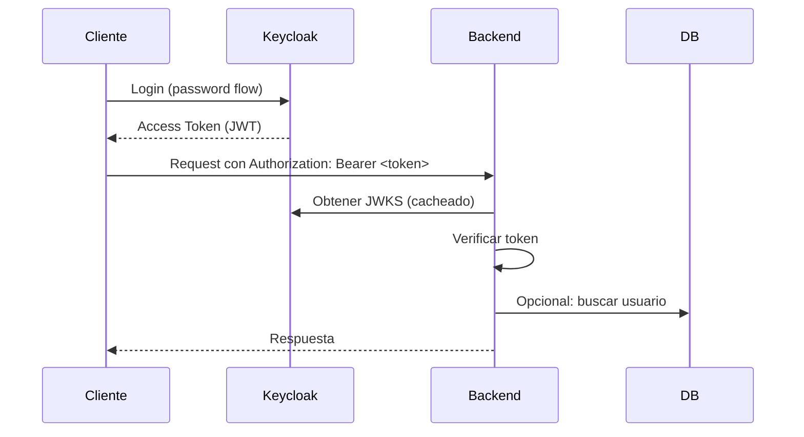

## **4. Configuración de Keycloak**

En KeyCloak tenemos estos tres roles:

- Rol de Realm
- Rol de Client
- Rol Compuesto

En KeyCloak no hay roles de usuario. Probablemente lo confundas con la asignación de roles de usuario, que consiste básicamente en asignar un rol (de dominio, de cliente o compuesto) a un usuario específico.

Para comprender cómo funcionan estos roles, veamos primero un modelo de dominio simple. Como puedes ver en la imagen a continuación, cada dominio tiene uno o varios clientes. Y cada cliente puede tener varios usuarios asociados.

![[Pasted image 20250618184648.png]]

A partir de esto, debería ser fácil deducir cómo funcionan las asignaciones de roles.

Rol de Realm: Es un rol global que pertenece a ese dominio específico. Puedes acceder a él desde cualquier cliente y asignarlo a cualquier usuario. Por ejemplo, rol: "Administrador global, Administrador".

Rol de Client: Es un rol que pertenece solo a ese cliente específico. No puedes acceder a ese rol desde otro cliente. Solo puedes asignarlo a los usuarios de ese cliente. Roles por ejemplo: «Empleado, Cliente»

Rol compuesto: Es un rol que tiene uno o más roles (de ámbito o de cliente) asociados.


### Crear un rol de reino (realm)

Los roles a nivel de **reino** son un espacio de nombres para definir tus roles. Para ver la lista de roles, haz clic en **Roles del Reino** en el menú.


**Procedimiento**

1. Haz clic en **Crear rol**.
    
2. Ingresa un **Nombre del rol**.
    
3. Ingresa una **Descripción**.
    
4. Haz clic en **Guardar**.
    

---

### Roles de cliente

Los roles de cliente son espacios de nombres dedicados a cada cliente. Cada cliente tiene su propio espacio de nombres. Los roles de cliente se gestionan en la pestaña **Roles** de cada cliente. Interactúas con esta interfaz de la misma forma que lo haces con los roles a nivel de reino.

---

### Convertir un rol en un rol compuesto

Cualquier rol a nivel de reino o cliente puede convertirse en un **rol compuesto**. Un rol compuesto es un rol que tiene uno o más roles adicionales asociados a él. Cuando se asigna un rol compuesto a un usuario, este también adquiere los roles asociados al rol compuesto. Esta herencia es recursiva, por lo que los usuarios también heredan cualquier rol compuesto de otros compuestos. Sin embargo, se recomienda no abusar del uso de roles compuestos.

**Procedimiento**

1. Haz clic en **Roles del Reino** en el menú.
    
2. Haz clic en el rol que deseas convertir.
    
3. En la lista **Acción**, selecciona **Agregar roles asociados**.
    

**Rol compuesto**


En este ejemplo, el rol a nivel de reino **employee** está asociado al rol compuesto **developer**. Cualquier usuario con el rol **developer** también hereda el rol **employee**.


---

### Asignar roles

Puedes asignar roles a un usuario mediante la pestaña **Mapeo de roles** del usuario correspondiente.

**Procedimiento**

1. Haz clic en **Usuarios** en el menú.
    
2. Haz clic en el usuario al que deseas asignar un rol.
    
3. Haz clic en la pestaña **Mapeo de roles**.
    
4. Haz clic en **Asignar rol**.
    
5. Selecciona el rol que deseas asignar desde el cuadro de diálogo.
    
6. Haz clic en **Asignar**.
    

**Mapeo de roles**


En el ejemplo anterior, se está asignando el rol compuesto **developer** a un usuario. Ese rol fue creado en la sección de [Roles Compuestos](https://www.keycloak.org/docs/latest/server_admin/#_composite-roles).

**Mapeo de roles efectivos**


Cuando se asigna el rol **developer**, el rol **employee** asociado al compuesto **developer** se muestra con **Heredado** en "True". Los roles **heredados** son aquellos explícitamente asignados al usuario o heredados de otros roles compuestos.

---

### Usar roles predeterminados

Usa roles predeterminados para asignar automáticamente roles a los usuarios cuando son creados o importados mediante [Intermediación de Identidad](https://www.keycloak.org/docs/latest/server_admin/#_identity_broker).

**Procedimiento**

1. Haz clic en **Configuración del Reino** en el menú.
    
2. Haz clic en la pestaña **Registro de usuario**.
    

**Roles predeterminados**


Esta captura muestra que ya existen algunos **roles predeterminados**.


### **4.1 Requisitos en Keycloak**
1. Crear un realm y un client (confidencial o público)
2. Configurar mappers para incluir roles en el token:
   - En "Clients" > [tu-client] > Roles
   - Crear mapper de tipo "User Realm Role"
3. Establecer tiempo de vida del token según necesidades

### **4.2 Ejemplo de Token Decodificado**
```json
{
  "iss": "http://localhost:8080/realms/mi-realm",
  "aud": "mi-client",
  "preferred_username": "usuario1",
  "realm_access": {
    "roles": ["user", "editor"]
  },
  "scope": "openid email profile",
  "exp": 1672531200
}
```

---

## **5. Pruebas con Postman**


Desde Postman o tu frontend haces login y obtienes un **token JWT**:

```http
POST /realms/<REALM_NAME>/protocol/openid-connect/token
Content-Type: application/x-www-form-urlencoded

client_id=<CLIENT_ID>
grant_type=password
username=<USER>
password=<PASS>
```

Y recibes un token para usar en las APIs.

Aquí tienes el equivalente en `curl` para obtener un token JWT desde la línea de comandos en Linux:

```bash
curl -X POST \
  "http://<KEYCLOAK_HOST>/realms/<REALM_NAME>/protocol/openid-connect/token" \
  -H "Content-Type: application/x-www-form-urlencoded" \
  -d "client_id=<CLIENT_ID>" \
  -d "grant_type=password" \
  -d "username=<USER>" \
  -d "password=<PASS>" | jq
```

Reemplaza:
- `<KEYCLOAK_HOST>` con la dirección de tu servidor Keycloak (ej: `localhost:8080` o `auth.tudominio.com`)
- `<REALM_NAME>` nombre del realm
- `<CLIENT_ID>` con el id del client creado
- `<USER>` con el usuario 
- `<PASS>` con la contraseña

Si necesitas usar HTTPS y omitir la verificación del certificado (útil en entornos de desarrollo), añade `-k`:

```bash
curl -k -X POST \
  "http://<KEYCLOAK_HOST>/realms/<REALM_NAME>/protocol/openid-connect/token" \
  -H "Content-Type: application/x-www-form-urlencoded" \
  -d "client_id=<CLIENT_ID>" \
  -d "grant_type=password" \
  -d "username=<USER>" \
  -d "password=<PASS>" | jq
```

La respuesta será un JSON con el token de acceso (access_token) y otros datos.
## **6. Diagrama de Flujo**



