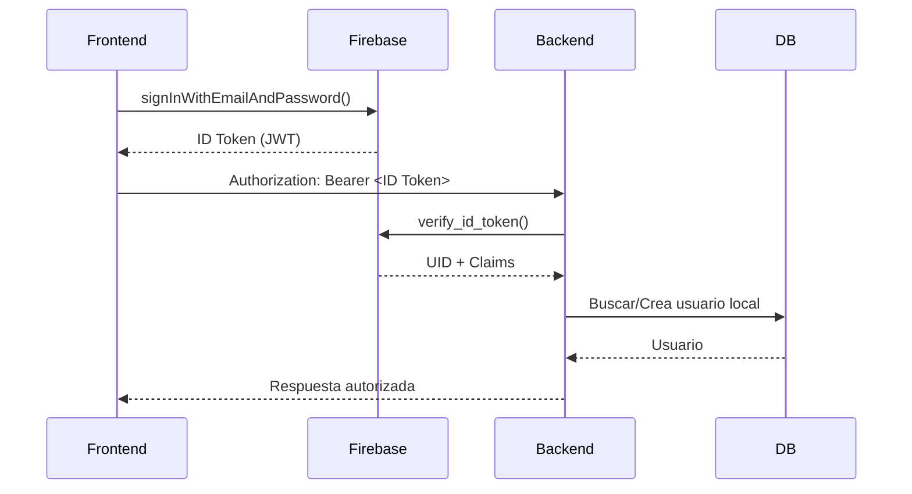

## 3. Backend en Python (Flask + Flask-RESTX)

### 3.1. Instalación

```bash
pip install firebase-admin PyJWT
```

### 3.2. Inicialización del SDK Firebase

```python
# app.py
import os
import firebase_admin
from firebase_admin import credentials


# Inicializar Firebase Admin SDK
firebase_cred_path = os.getenv("FIREBASE_CREDENTIALS", "firebase_credentials.json")
if not firebase_admin._apps:
	cred = credentials.Certificate(firebase_cred_path)
	firebase_admin.initialize_app(cred)

```

### 3.3. Verificación del ID Token de Firebase

```python
from firebase_admin import auth
from flask import request, abort

def verify_firebase_token():
    # Verifica si el token de Firebase está presente
	header = request.headers.get('Authorization', '')
	if not header.startswith('Bearer '):
		abort(401, 'Error de autenticación: Token ausente o inválido')
	
	# Extrae el token del encabezado
	token = header.split(' ', 1)[1]
	try:
		# Verifica el token con el SDK de Firebase
		decoded = auth.verify_id_token(token)
	except Exception:
		abort(401, 'Error de autenticación: Token inválido')
	
	# Obtiene el UID del token decodificado
	uid = decoded.get('uid')
	
```

Según la documentación oficial, `verify_id_token` lanza excepción si el token es inválido/expirado.
	
El token decodificado (`decoded`) contiene los claims públicos de Firebase, incluido `'uid'`, que identifica unívocamente al usuario. 
	
Usamos este UID para buscar o crear el usuario en nuestra base de datos local.
### 3.4. Decorador de Protección (Firebase Only)

```python
from functools import wraps
from flask import abort, request
from firebase_admin import auth

def firebase_required():
    def decorator(func):
        @wraps(func)
        def wrapper(*args, **kwargs):
            # Verifica si el token de Firebase está presente
            header = request.headers.get('Authorization', '')
            if not header.startswith('Bearer '):
                abort(401, 'Error de autenticación: Token ausente o inválido')

            # Extrae el token del encabezado	
            token = header.split(' ', 1)[1]
            try:
                # Verifica el token con el SDK de Firebase
                decoded = auth.verify_id_token(token)
            except Exception:
                abort(401, 'Error de autenticación: Token inválido')

            # Obtiene el UID del token decodificado
            uid = decoded.get('uid')
            
            return func(*args, **kwargs)
        return wrapper
    return decorator
```

### 3.5. Decorador con Roles Internos
Se puede manejar lógica interna de la API de usuarios (sin necesidad de modificar firebase), creando una copia en la base de datos local de uid de firebase, y cada vez que el usuario envie un token valido, se verifica logica interna, como Roles, Puntos, etc. Si no llegara a existir en la base de datos, se crea, pues ya está validado en firebase.  

```python
from functools import wraps
from flask import abort, request
from firebase_admin import auth
from src.features.users.user_service import UserService

def firebase_role_required(*required_roles):
    def decorator(func):
        @wraps(func)
        def wrapper(*args, **kwargs):
            
            # Verifica si el token de Firebase está presente
            header = request.headers.get('Authorization', '')
            if not header.startswith('Bearer '):
                abort(401, 'Error de autenticación: Token ausente o inválido')
            
            # Extrae el token del encabezado
            token = header.split(' ', 1)[1]
            try:
                # Verifica el token con el SDK de Firebase
                decoded = auth.verify_id_token(token)
            except Exception:
                abort(401, 'Error de autenticación: Token inválido')
            
            # Obtiene el UID del token decodificado
            uid = decoded.get('uid')

            
            # Verifica si el usuario existe en la base de datos
            user_response, status_code = UserService.get_user_by_uid(uid)
            if status_code == 404:
                user = UserService.create_user({'uid': uid})
                if not user:
                    abort(404, 'Error de autenticación: Usuario no encontrado')
            elif status_code == 200:
                user = user_response
            else:
                abort(status_code, user_response.get('error', 'Error desconocido'))
                
            
            # Verifica si el usuario tiene los roles requeridos
            if not required_roles:
                return func(*args, **kwargs)  # Si no se especifican roles, permite el acceso
            
            user_roles = user.get('roles', [])
            if not user_roles:
                abort(403, 'Error de autorización: Usuario sin roles asignados')
                
            # Comprueba si el usuario tiene al menos uno de los roles requeridos
            user_roles = [role.get('name', '').lower() for role in user_roles if 'name' in role]
            
            user_roles = [str(role).lower() for role in user_roles]
            roles = [role.lower() for role in required_roles]

            if not any(role in user_roles for role in roles):
                abort(403, 'Error de autorización: Permisos insuficiente')

            return func(*args, **kwargs)
        return wrapper
    return decorator
```
## 5. Protección de Rutas en Flask

### Sin Roles

```python
from src.security.firebase_required import firebase_required

class FeatureController(Resource):
	
	@firebase_required()
	@api.doc(description='Obtiene todos los recursos')
	@api.response(200, 'Éxito', [FeatureResponseDoc])
	@api.response(404, 'No se encontraron recursos', CommonResponseModel)
	@api.response(500, 'Error interno del servidor', CommonResponseModel)
	def get(self):
```

### Con Roles

```python
from src.security.firebase_required import firebase_role_required

class FeatureController(Resource):
	
	@firebase_role_required('admin', 'user')
	@api.doc(description='Obtiene todos los recursos')
	@api.response(200, 'Éxito', [FeatureResponseDoc])
	@api.response(404, 'No se encontraron recursos', CommonResponseModel)
	@api.response(500, 'Error interno del servidor', CommonResponseModel)
	def get(self):
```

## 6. Diagrama de Flujo: Verificación de Token




## 8. Resumen

| Componente          | Propósito                                                  |
| ------------------- | ---------------------------------------------------------- |
| ID Token (Firebase) | Autentica usuario y se firma con clave Google              |
| JWT                 | Formato de token compacto firmado                          |
| `verify_id_token`   | Verifica validez, firma y expiración del token             |
| `firebase-admin`    | SDK oficial para servidor                                  |
| Decorador Backend   | Protege rutas y ejecuta lógica post-validación             |
| UID                 | ID único por usuario, persistente en Firebase              |

