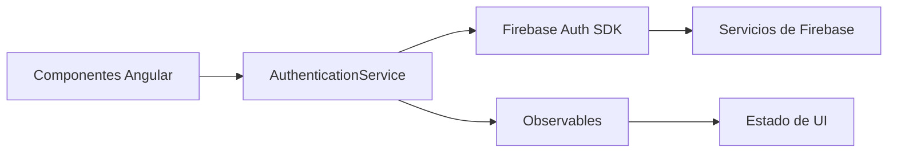
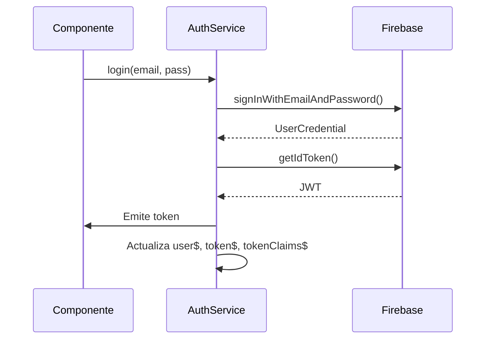

# Servicio de Autenticación en Angular con Firebase

## Visión General

Este servicio encapsula toda la lógica de autenticación con Firebase en una API reactiva basada en Observables. Proporciona:

- Métodos para operaciones básicas (login, registro, logout)
- Observables para estado de autenticación
- Gestión automática de tokens JWT
- Acceso a custom claims del token

## Diagrama de Componentes



## Implementación Completa

```ts
import { Injectable, inject } from '@angular/core';
import {
  Auth,
  onAuthStateChanged,
  signInWithEmailAndPassword,
  createUserWithEmailAndPassword,
  signOut,
  User,
  IdTokenResult,
  sendPasswordResetEmail,
  authState,
} from '@angular/fire/auth';
import { BehaviorSubject, from, Observable } from 'rxjs';
import { map, switchMap } from 'rxjs/operators';

@Injectable({ providedIn: 'root' })
export class AuthenticationService {
  private auth = inject(Auth); // Inyecta el servicio de autenticación de Firebase

  public readonly user$ = authState(this.auth); // Observable que emite el estado del usuario autenticado

  private tokenSubject = new BehaviorSubject<string | null>(null); // Subject para almacenar el token de autenticación
  public readonly token$ = this.tokenSubject.asObservable(); // Observable que emite el token de autenticación

  private tokenClaimsSubject = new BehaviorSubject<IdTokenResult | null>(null); // Subject para almacenar los claims del token
  public readonly tokenClaims$ = this.tokenClaimsSubject.asObservable(); // Observable que emite los claims del token

  constructor() {
    // Escucha los cambios en el estado de autenticación del usuario
    onAuthStateChanged(this.auth, async (user: User | null) => {
      if (user) {
        const token = await user.getIdToken();
        const claims = await user.getIdTokenResult();
        this.tokenSubject.next(token);
        this.tokenClaimsSubject.next(claims);
        console.log('User authenticated:', token, claims);
      } else {
        this.tokenSubject.next(null);
        this.tokenClaimsSubject.next(null);
      }
    });
  }

  /**
   * Inicia sesión con email y contraseña.
   * @param email correo electrónico del usuario
   * @param password contraseña del usuario
   * @returns Observable<string> que emite el token de autenticación del usuario
   * @throws Error si las credenciales son incorrectas o si ocurre un error de red
   */
  login(email: string, password: string): Observable<string> {
    return from(signInWithEmailAndPassword(this.auth, email, password)).pipe(
      switchMap((cred) => from(cred.user.getIdToken(true))),
      map((token) => token)
    );
  }

  /**
   * Registra un nuevo usuario con email y contraseña.
   * @param email correo electrónico del usuario
   * @param password contraseña del usuario
   * @returns Observable<string> que emite el token de autenticación del nuevo usuario
   */
  register(email: string, password: string): Observable<string> {
    return from(
      createUserWithEmailAndPassword(this.auth, email, password)
    ).pipe(
      switchMap((cred) => from(cred.user.getIdToken())),
      map((token) => token)
    );
  }

  /**
   * Cierra la sesión del usuario actual.
   * @returns Observable<void> que se completa cuando el usuario ha cerrado sesión
   */
  logout(): Observable<void> {
    return from(signOut(this.auth));
  }

  /**
   * Envía un correo electrónico para restablecer la contraseña del usuario.
   * @param email correo electrónico del usuario para enviar el enlace de restablecimiento de contraseña
   * @returns Observable<void> que se completa cuando se envía el correo electrónico
   */
  rememberPassword(email: string): Observable<void> {
    return from(sendPasswordResetEmail(this.auth, email));
  }

  /**
   * Obtiene el usuario actual autenticado.
   * @returns User | null el usuario actual o null si no hay un usuario autenticado
   */
  getCurrentUser(): User | null {
    return this.auth.currentUser;
  }

  /**
   * Obtiene el token de autenticación del usuario actual.
   * @returns Observable<string | null> que emite el token de autenticación o null si no hay un usuario autenticado
   */
  getToken(): Observable<string | null> {
    return this.token$.pipe(map((token) => token));
  }

  /**
   * Verifica si el usuario está autenticado.
   * @returns Observable<boolean> que emite true si hay un usuario autenticado, false en caso contrario
   */
  isAuthenticated(): Observable<boolean> {
    return this.user$.pipe(map((user) => !!user));
  }

  /**
   * Actualiza los claims del token del usuario actual.
   * @returns Observable<IdTokenResult | null> que emite los claims del token actualizado o null si no hay un usuario autenticado
   *
   * Esta función fuerza la actualización de los claims del token, lo que puede ser útil
   * para asegurarse de que se reflejen los cambios recientes en los roles o permisos del usuario.
   * Se debe llamar después de iniciar sesión o cuando se espera que los claims hayan cambiado.
   */
  updateTokenClaims(): Observable<IdTokenResult | null> {
    return this.user$.pipe(
      switchMap((user) => {
        if (!user) return [null];
        return from(user.getIdTokenResult(true)).pipe(
          map((claims) => {
            this.tokenClaimsSubject.next(claims);
            return claims;
          })
        );
      })
    );
  }
}
```

## Tabla de API Completa

| Método/Propiedad          | Tipo                           | Descripción |
|---------------------------|--------------------------------|-------------|
| `user$`                   | `Observable<User \| null>`     | Emite cambios en el estado del usuario |
| `token$`                  | `Observable<string \| null>`   | Proporciona el token JWT actual |
| `tokenClaims$`            | `Observable<IdTokenResult \| null>` | Emite los claims del token incluyendo custom claims |
| `login(email, password)`  | `(string, string) => Observable<string>` | Flujo completo de autenticación |
| `register(email, password)` | `(string, string) => Observable<string>` | Proceso de registro de nuevo usuario |
| `logout()`                | `() => Observable<void>`       | Cierre de sesión controlado |
| `rememberPassword(email)` | `(string) => Observable<void>` | Recuperación de contraseña |
| `getCurrentUser()`        | `() => User \| null`           | Acceso síncrono al usuario actual |
| `getToken()`              | `() => Observable<string \| null>` | Obtención reactiva del token |
| `isAuthenticated()`       | `() => Observable<boolean>`    | Estado de autenticación |
| `updateTokenClaims()`     | `() => Observable<IdTokenResult \| null>` | Actualización forzada de claims |

## Flujo de Autenticación



