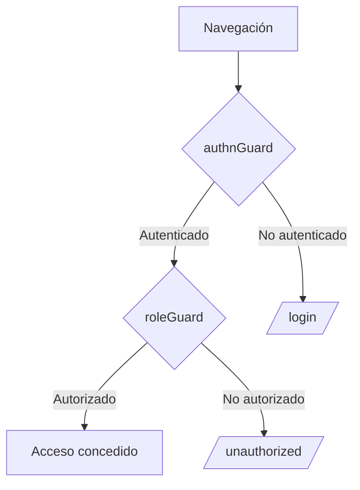

# Guards de Autenticación y Autorización en Angular

## Diagrama de Flujo de los Guards



## 1. Guard de Autenticación (authnGuard)

### Implementación Completa

```ts
// auth.guard.ts
import { inject } from '@angular/core';
import { CanActivateFn, Router } from '@angular/router';
import { map, take } from 'rxjs/operators';
import { AuthenticationService } from '../services/authn.service';

export const authnGuard: CanActivateFn = () => {
  const authService = inject(AuthenticationService);
  const router = inject(Router);

  return authService.user$.pipe(
    take(1), // se resuelve solo después de que Firebase determina el estado real
    map((user) => (user ? true : router.createUrlTree(['/login'])))
  );
};
```

### Comportamiento
- **Autenticado**: Permite acceso a la ruta
- **No autenticado**: Redirige a `/login`
- **Técnica**: Usa `UrlTree` para redirección limpia

## 2. Guard de Roles (roleGuard)

### Implementación Completa

```ts
// role.guard.ts
import { inject } from '@angular/core';
import { CanActivateFn, Router } from '@angular/router';
import { AuthenticationService } from '../services/authn.service';
import { AuthorizationService } from '../services/authz.service';

export const roleGuard: CanActivateFn = (route, state) => {
  const authn = inject(AuthenticationService);
  const authz = inject(AuthorizationService);
  const router = inject(Router);

  // Obtener roles requeridos desde route.data.roles
  const requiredRoles = route.data?.['roles'];

  // Verificar que el usuario esté autenticado y tenga los roles requeridos
  const hasAccess = authn.isAuthenticated() && authz.hasRole(requiredRoles);

  if (!hasAccess) {
    router.navigate(['/unauthorized']);
    return false;
  }

  return true;
};
```

### Comportamiento
- **Autorizado**: Permite acceso
- **No autorizado**: Redirige a `/unauthorized`
- **Flexibilidad**: Acepta rol único o array de roles

---

## Ejemplo Integrado en app.routes.ts

```ts
import { Routes } from '@angular/router';
import { authnGuard } from './auth/guards/auth.guard';
import { roleGuard } from './auth/guards/role.guard';

export const routes: Routes = [
  // Ruta pública
  {
    path: 'home',
    loadComponent: () => import('./pages/home.component')
  },

  // Ruta protegida solo por autenticación
  {
    path: 'dashboard',
    loadComponent: () => import('./pages/dashboard.component'),
    canActivate: [authnGuard]
  },

  // Ruta protegida por rol específico
  {
    path: 'admin',
    loadComponent: () => import('./pages/admin.component'),
    canActivate: [authnGuard, roleGuard],
    data: { roles: 'admin' } // Formato simple
  },

  // Ruta protegida por múltiples roles
  {
    path: 'editor',
    loadComponent: () => import('./pages/editor.component'),
    canActivate: [authnGuard, roleGuard],
    data: { roles: ['editor', 'content-manager'] } // Formato array
  },

  // Rutas de autenticación
  {
    path: 'login',
    loadComponent: () => import('./pages/login.component')
  },
  {
    path: 'unauthorized',
    loadComponent: () => import('./pages/unauthorized.component')
  },

  // Redirección por defecto
  { path: '', redirectTo: 'home', pathMatch: 'full' }
];
```

## Tabla Comparativa de Guards

| Característica          | authnGuard                          | roleGuard                           |
|-------------------------|-------------------------------------|-------------------------------------|
| **Propósito**           | Verificar autenticación             | Verificar roles                     |
| **Redirección**         | A login                             | A unauthorized                      |
| **Dependencias**        | AuthenticationService               | Authn + Authz Services              |
| **Tipo de retorno**     | Observable<boolean \| UrlTree>      | boolean                             |
| **Configuración**       | Sin parámetros                      | Requiere data.roles en ruta         |

## Buenas Prácticas

1. **Orden de ejecución**:
   ```ts
   canActivate: [authnGuard, roleGuard] // Primero autenticación, luego roles
   ```

2. **Manejo de datos**:
   ```ts
   data: { 
     roles: ['admin', 'superuser'],
     // Otros metadatos
   }
   ```

3. **Optimización**:
   - Usar `take(1)` para completar observables
   - Evitar lógica compleja en guards

4. **Seguridad**:
   - Siempre validar permisos también en backend
   - Considerar lazy loading para rutas privilegiadas
