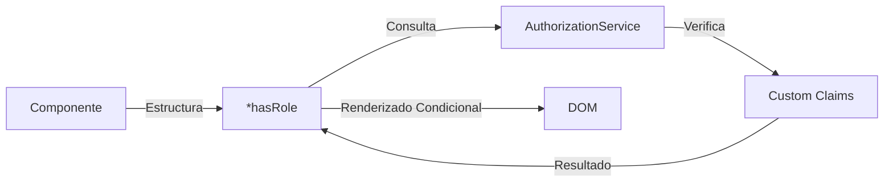

# Directiva Estructural `*hasRole` para Control de Acceso

## Diagrama de Funcionamiento



## Implementación Completa

```ts
// has-role.directive.ts
import {
  Directive,
  inject,
  Input,
  TemplateRef,
  ViewContainerRef,
} from '@angular/core';
import { AuthorizationService } from '../services/authz.service';

@Directive({
  selector: '[hasRole]',
})
export class HasRoleDirective {
  private authz = inject(AuthorizationService);

  constructor(
    private templateRef: TemplateRef<any>,
    private viewContainer: ViewContainerRef
  ) {}

  @Input() set hasRole(requiredRoles: string | string[]) {
    const canRender = this.authz.hasRole(requiredRoles);

    this.viewContainer.clear();

    if (canRender) {
      this.viewContainer.createEmbeddedView(this.templateRef);
    }
  }
}
```

## Características Clave

1. **Soporte para múltiples formatos**:
   - Rol único: `*hasRole="'admin'"`
   - Múltiples roles: `*hasRole="['editor', 'manager']"`

2. **Eficiencia**:
   - Limpia la vista antes de evaluar condiciones
   - Solo renderiza cuando los permisos son válidos

3. **Integración**:
   - Utiliza el mismo `AuthorizationService` que los guards
   - Compatible con estrategias de cambio detección de Angular

## Ejemplo de Uso en Componente Standalone

```ts
import { Component } from '@angular/core';
import { CommonModule } from '@angular/common';
import { HasRoleDirective } from './has-role.directive';
import { AuthorizationService } from './authorization.service';

@Component({
  selector: 'app-dashboard',
  standalone: true,
  imports: [CommonModule, HasRoleDirective],
  template: `
    <h1>Panel de control</h1>

    <!-- Ejemplo con rol único -->
    <button *hasRole="'admin'">Administrar usuarios</button>

    <!-- Ejemplo con múltiples roles -->
    <div *hasRole="['editor', 'admin']">
      <p>Sección de publicaciones</p>
    </div>

    <!-- Ejemplo combinado con otras directivas -->
    <ng-container *hasRole="'auditor'">
      <app-audit-log [refresh]="true"></app-audit-log>
    </ng-container>
  `
})
export class DashboardComponent {
  constructor(public authz: AuthorizationService) {}
}
```

## Comparación de Enfoques

| Enfoque                  | Ventajas                          | Limitaciones                  |
|--------------------------|-----------------------------------|-------------------------------|
| Directiva `*hasRole`     | Sintaxis declarativa, reusable    | Menos flexible para lógica compleja |
| Control Flow `@if`       | Más flexible, mejor tipado        | Requiere inyección manual     |
| Guard de Ruta            | Protección a nivel de ruta        | No afecta a elementos UI      |

## Uso con Control Flow (Angular v17+)

```ts
import { Component, inject } from '@angular/core';
import { AuthorizationService } from './authorization.service';

@Component({
  standalone: true,
  template: `
    @if (authz.hasRole('editor')) {
      <p>Contenido exclusivo para editores</p>
    } @else {
      <p>No tienes permisos para ver este contenido</p>
    }
  `
})
export class ContentComponent {
  authz = inject(AuthorizationService);
}
```

## Ejemplo Avanzado con Input Dinámico

```ts
@Component({
  standalone: true,
  imports: [HasRoleDirective],
  template: `
    <div *hasRole="requiredRoles">
      Contenido restringido
    </div>
  `
})
export class DynamicRoleComponent {
  requiredRoles = ['admin', 'supervisor'];
}
```
