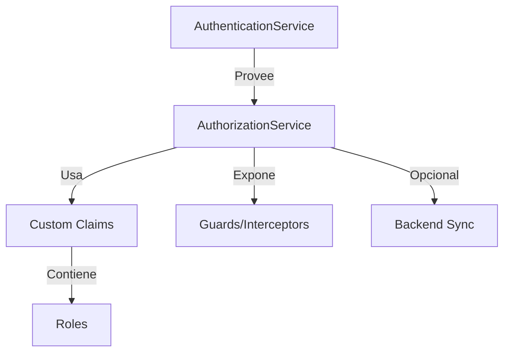
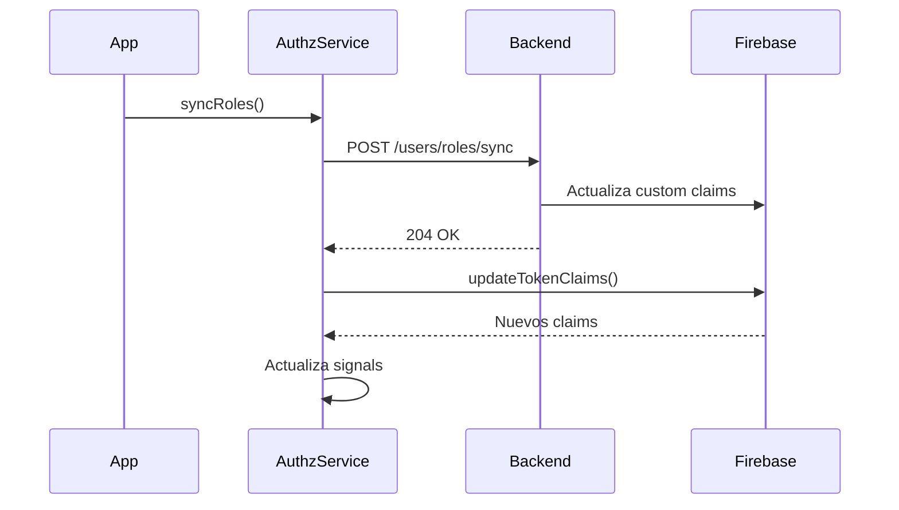

# Servicio de Autorización en Angular

## Diagrama de Arquitectura



## Objetivos del Servicio

1. **Gestión centralizada de roles**:
   - Lectura de roles desde claims del token
   - Verificación de permisos
   - Sincronización con backend

2. **Integración con**:
   - Guards de rutas
   - Interceptores HTTP
   - Directivas estructurales

## Implementación Completa

```ts
import { computed, inject, Injectable, signal } from '@angular/core';
import { AuthenticationService } from './authn.service';
import { IdTokenResult } from '@angular/fire/auth';
import { HttpClient } from '@angular/common/http';
import { take } from 'rxjs/operators';
import { environment } from '../../../environments/environment';

@Injectable({
  providedIn: 'root',
})
export class AuthorizationService {
  // Inyecta el servicio de autenticación para acceder a los claims del token
  private authService = inject(AuthenticationService);

  // Indica si los roles ya han sido sincronizados con el servidor
  private synced = false;

  // Signal reactivo con los claims del token actual
  private tokenClaimsSig = signal<IdTokenResult | null>(null);

  constructor(private http: HttpClient) {
    // Suscribe a los cambios en los claims del token
    this.authService.tokenClaims$.subscribe((claims) => {
      // Actualiza el signal con los nuevos claims
      this.tokenClaimsSig.set(claims);
    });
  }

  /**
   * Obtiene los roles del usuario actual desde los claims del token.
   * @returns Un array de roles del usuario actual.
   * Si no hay roles definidos, devuelve un array vacío.
   */
  readonly roles = computed(() => {
    const claims = this.tokenClaimsSig();
    const roles = claims?.claims?.['roles'];
    return Array.isArray(roles) ? roles : [];
  });

  /**
   * Verifica si el usuario tiene al menos uno de los roles requeridos.
   * @param required Un rol o un array de roles requeridos.
   * @returns true si el usuario tiene al menos uno de los roles requeridos, false en caso contrario.
   */
  hasRole(required: string | string[]): boolean {
    const userRoles = this.roles();

    if (Array.isArray(required)) {
      return required.some((role) => userRoles.includes(role));
    }

    return userRoles.includes(required);
  }

  /**
   * Verifica si el usuario tiene todos los roles requeridos.
   * @param required Un array de roles requeridos.
   * @returns true si el usuario tiene todos los roles requeridos, false en caso contrario.
   */
  hasAllRoles(required: string[]): boolean {
    const userRoles = this.roles();
    return required.every((role) => userRoles.includes(role));
  }

  /**
   * Obtiene los roles del usuario actual.
   * @returns Un array de roles del usuario actual.
   */
  getRoles(): string[] {
    return this.roles();
  }

  /**
   * Verifica si el usuario tiene al menos un rol asignado.
   * @returns true si el usuario tiene al menos un rol, false en caso contrario.
   */
  hasAnyRole(): boolean {
    return this.getRoles().length > 0;
  }

  /**
   * Sincroniza los roles del usuario con el servidor.
   * Llama a la API para actualizar los roles del usuario actual.
   * Solo se ejecuta una vez por sesión para evitar múltiples llamadas innecesarias.
   * Si el usuario está autenticado, actualiza los claims del token.
   *
   * Esta función se debe llamar al iniciar la aplicación o cuando el usuario inicia sesión.
   * Asegura que los roles del usuario estén actualizados con los del servidor.
   *
   * @returns void
   * @example
   * this.authzService.syncRoles();
   */
  syncRoles(): void {
    if (!this.synced && this.authService.getCurrentUser()) {
      this.synced = true;
      this.http
        .post(environment.apiUrl + '/users/roles/sync', {})
        .pipe(take(1))
        .subscribe({
          next: () => {
            // Solo actualiza claims si el usuario sigue autenticado
            if (this.authService.getCurrentUser()) {
              this.authService
                .updateTokenClaims()
                .pipe(take(1))
                .subscribe({
                  next: (claims) => {},
                  error: (err) => {},
                });
            }
          },
          error: (err) => {
            console.error('Error al sincronizar el usuario:', err);
          },
        });
    }
  }
}
```

## Tabla de API 

| Método/Propiedad        | Tipo                            | Descripción                           |
| ----------------------- | ------------------------------- | ------------------------------------- |
| `roles`                 | `ComputedSignal<string[]>`      | Roles actuales del usuario (reactivo) |
| `hasRole(required)`     | `(string\|string[]) => boolean` | Verifica al menos un rol              |
| `hasAllRoles(required)` | `(string[]) => boolean`         | Verifica todos los roles              |
| `getRoles()`            | `() => string[]`                | Obtiene roles actuales                |
| `hasAnyRole()`          | `() => boolean`                 | Verifica si tiene algún rol           |
| `syncRoles()`           | `() => void`                    | Sincroniza roles con backend          |

## Flujo de Sincronización de Roles



## Consideraciones Clave

1. **Seguridad**:
   - Los roles en frontend son solo para UX
   - Siempre validar permisos en backend

2. **Performance**:
   - Signals garantizan actualizaciones eficientes
   - Sincronización única por sesión

3. **Dependencias**:
   - Requiere `AuthenticationService` configurado
   - Opcional: HttpClient para sincronización

## Uso Típico

```ts
// En un guard
canActivate(): Observable<boolean> {
  return this.authService.isAuthenticated().pipe(
    map(authenticated => {
      return authenticated && 
             this.authzService.hasRole(['admin', 'editor']);
    })
  );
}

// En un componente
adminOnlyAction() {
  if (!this.authzService.hasRole('admin')) {
    throw new Error('Requiere rol admin');
  }
  // Lógica restringida
}
```
